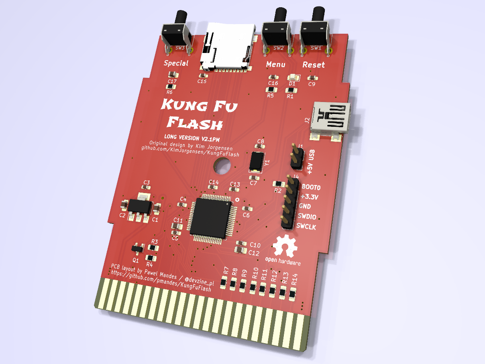
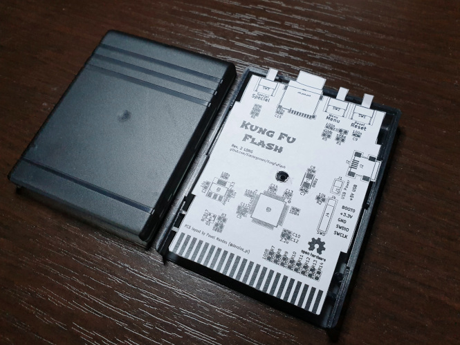
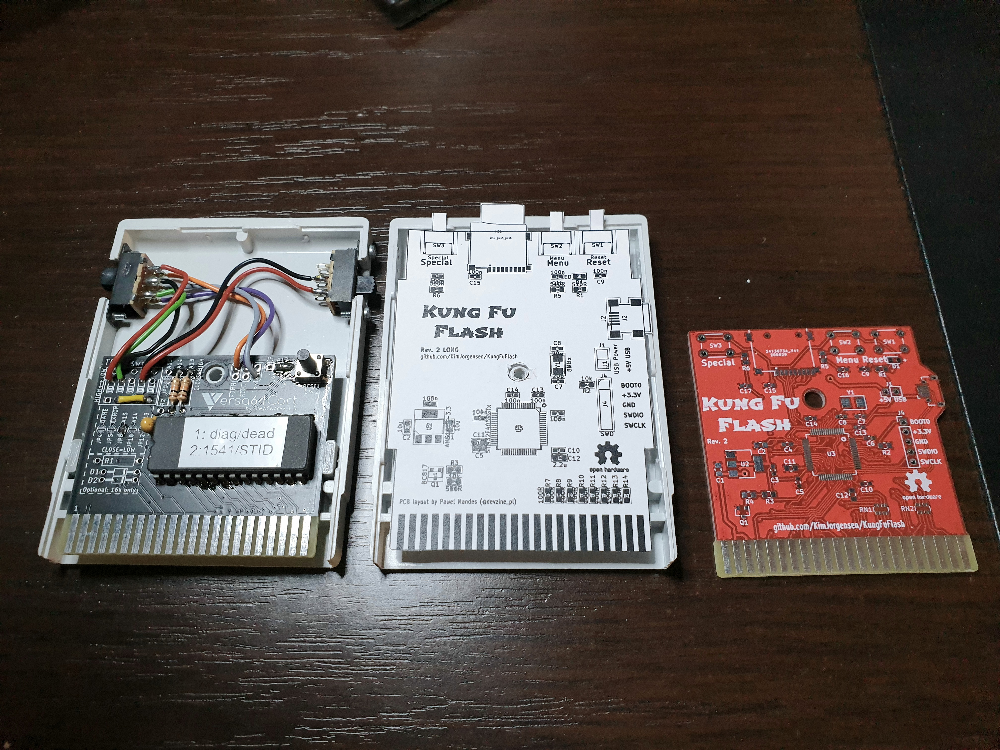
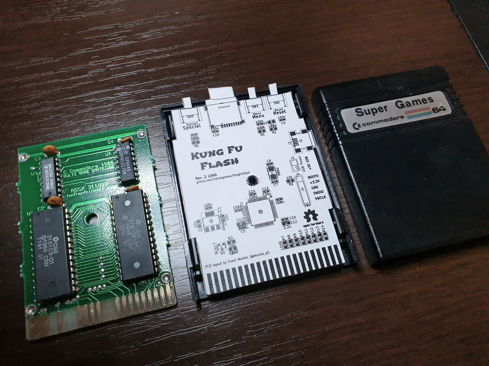

# Kung Fu Flash - Long PCB version

This version of the cartridge was developed for the following purposes:
- to fit into standard housings matching PCBs in format and size of the EasyFlash 3 cartridge
- to make SMD manual soldering easier
- to prevent the leverage effect when pressing the buttons from above, which stressed the cartridge connector and caused the C64 to crash.

The original design can be found [here](https://github.com/KimJorgensen/KungFuFlash).

Main changes:
- project migrated to KiCad 6.0
- 3D models for all components
- long PCB to fit common housings
- right angle tactile switches
- more durable Mini USB B socket for data transfer (you can use the same cable as EF3)
- 100Ω 0805 resistors for easier manual soldering (instead of resitor arrays)

The gerber files:
[KungFuFlash-Long-v2.1-PM.zip](https://github.com/pmandes/KungFuFlash/blob/long-board-cart/hardware/gerber/KungFuFlash-Long-v2.1-PM.zip)

Compatible housings:
- [KM-20B](https://www.tme.eu/en/details/km-20b/multipurpose-enclosures/maszczyk/)
- [Z7](https://www.kradex.eu/product/enclosures_two_part/z7_ps?lang=en)
- [Thingiverse](https://www.thingiverse.com/thing:1702546)
- "Commodore" type and others that EF3 fits

# Kung Fu Flash
Cartridge for the Commodore 64 that packs a punch.

Kung Fu Flash can emulate different cartridge types, load PRG files and use D64 disk images.
Just place your desired CRT, PRG or D64 files on a FAT formatted microSD card and use the built-in launcher to execute them.

## Hardware
There are three buttons on the cartridge; a reset button, a menu button for starting the launcher, and a special button that is used by the freezer cartridges.

The PCB will fit the Stumpy Cartridge Case from TFW8b, you just need to drill some holes for the buttons and make a cut for the microSD card.
If you have mounted the USB connector you will need to cut a hole for that as well.

You can also 3D print a cartridge case as the one designed by bigby, [see here](https://www.thingiverse.com/thing:4153414).

The gerber files and BOM can be found [here](https://github.com/KimJorgensen/KungFuFlash/releases/tag/rev.2).

## Supported Cartridges
The following cartridge types are currently supported:

* Normal cartridge (8k, 16k, Ultimax)
* Action Replay v4.x/v5/v6
* KCS Power Cartridge
* Final Cartridge III(+)
* Simons' BASIC
* Fun Play, Power Play
* Super Games
* Ocean type 1
* Epyx Fastload
* C64 Game System, System 3
* WarpSpeed
* Dinamic
* Zaxxon, Super Zaxxon
* Magic Desk, Domark, HES Australia
* Super Snapshot v5
* Comal-80
* EasyFlash
* Prophet64
* Freeze Frame
* Freeze Machine
* RGCD, Hucky
* Drean
* C128 Normal Cartridge (external function ROM)

## Supported File Types
The following file types are currently supported:

* Cartridge (CRT)
* C128 cartridge (ROM, BIN)
* Disk image (D64, D71, D81)
* Tape image (T64)
* Program (PRG, P00)
* Firmware update (UPD)

## USB Port
The USB port is active while the launcher is running allowing programs to be transferred from a PC using the EasyFlash 3 USB protocol.
Kung Fu Flash shows up as a standard serial port when connected to a PC not requiring any custom drivers to be installed.
This means, however, that the program on the PC side must be modified to support Kung Fu Flash.
For that reason a modified version of [EasyFlash 3 USB Utilities](3rd_party/ef3utils) and [EasyFlash 3 BBS](3rd_party/ef3bbs) has been included in this repository.

## Firmware Update
Just place the KungFuFlash_v1.xx.upd file on the SD card and select the file in the launcher to initiate the firmware update.
The newest firmware can be found [here](https://github.com/KimJorgensen/KungFuFlash/releases/).

For initial firmware installation, [see here](firmware/README.md).

## Limitations
Kung Fu Flash is a so called Software Defined Cartridge where a fast microcontroller emulates cartridge hardware in software.
This makes it extremely flexible, allowing different cartridge types to be supported at a relative low cost.

However, it can be challenging to get the C64 bus timing correct in software and in some places the timing is very close to the limit.
Even though Kung Fu Flash has been tested on different models of the Commodore 64, there is a chance that it doesn't work correctly on your specific model.
Use it at your own risk!

Kung Fu Flash will work with the PAL version of the Commodore 64 or Commodore 128. Support for the NTSC version is still considered experimental.

Disk drive emulation is using kernal vectors and will not work with fast loaders or software that uses direct hardware access which a lot of games does. Currently REL files are not supported and there is only limited write support.

## Thanks
Kung Fu Flash was based on or uses other open source projects:

* [EasyFlash 3](https://bitbucket.org/skoe/easyflash) by Thomas Giesel
* [Draco Browser](https://csdb.dk/release/?id=89910) by Sascha Bader
* [fatfs-stm32](https://github.com/colosimo/fatfs-stm32) by Aurelio Colosimo
* [FatFs](http://elm-chan.org/fsw/ff/00index_e.html) by ChaN
* [libusb_stm32](https://github.com/dmitrystu/libusb_stm32) by Dmitry Filimonchuk
* [stm32f4-bare-metal](https://github.com/fcayci/stm32f4-bare-metal) by Furkan Cayci
* [OpenC64Cart](https://github.com/SukkoPera/OpenC64Cart) by Giorgioggì
* [EasyFlash 3 USB Utilities](https://csdb.dk/release/?id=150097) by Tomaz Kac
* [Disk2easyflash](https://csdb.dk/release/?id=150323) by ALeX Kazik

and a few others. Please check the individual files for their license.

Thanks to Bjørn N. Jørgensen for giving this project its name.

Special thanks to the author of [Sidekick64](https://github.com/frntc/Sidekick64) Carsten Dachsbacher for his support and inspiration.
